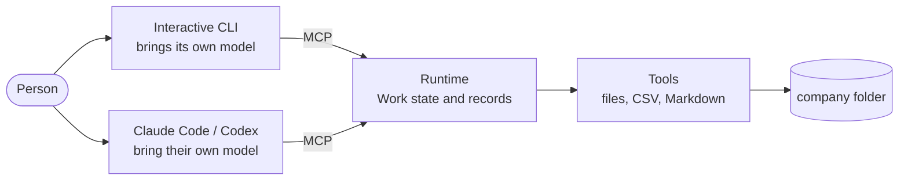

<p align="center">
  <picture>
    <source media="(prefers-color-scheme: dark)" srcset="assets/openshain_horizontal_lockup_color_for-dark.svg">
    
  </picture>
</p>

<p align="center">An interactive agent harness that turns a general agent into a professional employee of your company.</p>

<p align="center">
  <a href="https://github.com/openshain/openshain/actions/workflows/ci.yml"></a>
  <a href="https://www.npmjs.com/package/openshain"></a>
  <a href="LICENSE"></a>
</p>

<p align="center">
  <a href="#three-lines-to-start">Three lines to start</a> ·
  <a href="#what-it-does">What it does</a> ·
  <a href="#usage">Usage</a> ·
  <a href="#from-claude-code">From Claude Code</a> ·
  <a href="#bringing-knowledge-in">Knowledge</a> ·
  <a href="#design-principles">Principles</a> ·
  <a href="https://openshain.jp">Website</a> ·
  <a href="README.md">日本語</a>
</p>

The Japanese [README.md](README.md) is the primary one; documentation is written in Japanese first.

```
$ openshain
openshain · サンプル株式会社 · 社員エージェント みなと · anthropic/claude-haiku-4-5-20251001
 ╔═╗ ╔═╗ ╔═╗ ╔╗╔ ╔═╗ ╦ ╦ ╔═╗ ╦ ╔╗╔
 ║ ║ ╠═╝ ║╣  ║║║ ╚═╗ ╠═╣ ╠═╣ ║ ║║║
 ╚═╝ ╩   ╚═╝ ╝╚╝ ╚═╝ ╩ ╩ ╩ ╩ ╩ ╝╚╝
openshain 0.1.0
/home/alice/sample-company

> Total July's receipts by category and write the counts and sums to summary.md

  ⎿ fs_list .
  ⎿ fs_list receipt
  ⎿ csv_read receipt/2026-07.csv
  ⎿ csv_aggregate receipt/2026-07.csv
  ⎿ fs_write summary.md
  ⎿ Completed.
  ⎿ wrote summary.md
  ⎿ model calls 6, tool calls 5, input 22738 tokens (4602 cached), output 1077 tokens
  ⎿ Nobody needs to act next.

⏺ Done.
  
  I totalled July's receipts by category and wrote summary.md.
  
  Receipts: 296
  Grand total: 3,258,930 yen
  
  By category:
  - Meetings: 18 receipts, 23,370 yen
  - Advertising: 31 receipts, 793,220 yen
  - Fees: 31 receipts, 1,170,950 yen
  - Books and subscriptions: 24 receipts, 104,580 yen
  - Travel: 66 receipts, 132,980 yen
  - Utilities: 31 receipts, 585,690 yen
  - Supplies: 28 receipts, 99,300 yen
  - Welfare: 18 receipts, 38,570 yen
  - Shipping: 20 receipts, 137,900 yen
  - Communications: 29 receipts, 172,370 yen
  
  They are in summary.md.
```

The interactive CLI, in conversation with an employee agent.

## Three lines to start

```
npm install -g openshain   # requires Node.js 22 or later
openshain init             # writes the configuration and the MCP registration into the company folder
openshain                  # starts talking with the employee agent
```

> [!IMPORTANT]
> The model's API key is read from the environment only (`ANTHROPIC_API_KEY` and the like). It is never written to the configuration or the records.

Agents such as Claude and Codex cannot work as an employee of a company as they are. They lack the rules and procedures of the company, the means to operate SaaS and Office files, permissions and approval, work state that survives a session, and a trail of what was done and what it cost.

openshain is an agent harness that supplies what an agent needs to work as an employee of your company. You do not have to use the openshain CLI: the **MCP server** openshain provides lets you build your own harness on top of Claude Code or Codex.

## What it does

- **Interactive CLI**: `openshain` starts a conversation with an employee agent. Give it a request and the agent turns it into a Work, carries it out, and reports back
- **Recorded, resumable Work**: every request runs as a Work, and its course and result are kept in `work/<id>/events.jsonl`. A Work that stopped is continued from the conversation with `/work resume <id>`
- **Models**: the configuration file written by `openshain init` names the model the interactive CLI uses. You use your own API key (Bring Your Own Key). Anthropic and OpenAI-compatible APIs are supported. From Claude Code or Codex, no model configuration and no API key are needed
- **Standard tools**: read, write, and search files, read and aggregate CSV, and read Markdown, all inside the company folder. Nothing leaves it, and no file is handed to the model whole
- **Your own tools**: a third-party tool is one line in the configuration, and it is available from both the CLI and MCP
- **From Claude Code and other agents**: `openshain mcp` is the MCP server. Register it in Claude Code or Codex and the same harness works on top of those agents

### Professions available today

- General (`generic`): general office work over the files in the company folder
- (In development) Accounting: reconciling ledgers against receipts, monthly summaries, and knowledge specific to accounting

The profession is chosen with `profession` in `openshain.yaml`. Write instructions and the places to read, and that defines your own profession.

> [!NOTE]
> Permissions, approval, and escalation to an expert are still to come.

### How it fits together



The clients think: the interactive CLI, Claude Code and Codex each bring their own model. The Runtime calls no model; it offers Work state, tools and records as MCP tools. The interactive CLI and Claude Code use the same tools under the same rules and leave the same record under `work/`.

## Install

### With npm

Requires [Node.js](https://nodejs.org) 22 or later.

```
npm install -g openshain   # installs the openshain command
openshain --help           # checks that it is there
```

`npx openshain` runs it without installing. pnpm and yarn install the same name.

### With Bun

```
bun install -g openshain   # Bun 1.3 or later; the command runs on Node.js, so Node.js is needed too
bunx --bun openshain       # runs on Bun alone, without Node.js
```

<details>
<summary>Binaries and from source</summary>

### Binaries

[GitHub Releases](https://github.com/openshain/openshain/releases) carries single-file binaries for Linux (x64, arm64) and macOS (x64, arm64). Download one, make it executable, and put it on your PATH under the name `openshain`.

```
chmod +x openshain-linux-x64            # makes it executable
mv openshain-linux-x64 ~/.local/bin/openshain   # puts it on your PATH
```

#### macOS

> [!TIP]
> Gatekeeper blocks the first run of a binary downloaded with a browser. Remove the quarantine attribute before running it.

```
xattr -d com.apple.quarantine openshain   # removes the quarantine attribute
```

#### Windows

There is no Windows binary yet. Install with Bun, or use the Linux binary under WSL.

### From source

```
git clone https://github.com/openshain/openshain.git && cd openshain
bun install                      # installs dependencies
bun run build                    # writes the single-file binary to dist/openshain
```

</details>

## Usage

```
mkdir my-company && cd my-company   # creates the company folder
openshain init                      # writes the configuration, the MCP registration, and AGENTS.md
export ANTHROPIC_API_KEY=...        # the API key of the model the interactive CLI uses
openshain                           # starts the conversation with the employee agent
```

`openshain` is a full-screen conversation: the history above, the input line below. Write a request and the employee agent turns it into a Work, progress flows past on the `⎿` lines, and the result comes back. When a Work asks a question, you answer it in place. `/help` lists the keys and the slash commands.

```
openshain                       # starts the interactive CLI
openshain init                  # initializes the company folder
openshain work list             # lists Works
openshain work show <id>        # reads the record of a Work
openshain tools list            # lists the tools available
openshain mcp                   # runs as an MCP server (normally the agent starts it)
```

An example of adding a tool is in [examples/](examples/README.md).

### From Claude Code

1. `openshain init` writes `.mcp.json` into the company folder. If one is already there, it keeps the other servers and adds only the openshain entry. No model configuration and no API key are needed; the `model` section of `openshain.yaml` can be deleted
2. Start `claude` in the company folder and trust the folder. Claude Code reads `.mcp.json`, starts `openshain mcp` itself, and connects. openshain appears under `/mcp`
3. Write a request. Claude Code does the thinking, and openshain's tools do the reading, writing, and recording in the company folder. `AGENTS.md` tells it which is which
4. The record and the output of the request stay in `work/` in the company folder, readable with `openshain work list` and `openshain work show <id>`

Any other agent, Codex included, follows the same steps as Claude Code once `openshain mcp` is registered as a stdio MCP server.

## Configuration

`openshain.yaml` describes the company, the profession, the model, and the tools.

- Every field is in [docs/configuration.md](docs/configuration.md)
- The `openshain.yaml` written by `openshain init` explains each field in comments

## Bringing knowledge in

An employee agent needs two kinds of knowledge to work as a person of the company: the company's own rules, and knowledge specific to the Japanese jurisdiction. They enter through different places and routes.

### The company's own policies and knowledge

The company's rules (expense policies, approval thresholds, how each counterparty is handled, document formats) and the company's records (ledgers, contracts, past filings). In the current version they enter by three routes.

- `profession.instructions` in `openshain.yaml`. The instructions of the profession, placed at the top of the system prompt of every Work. Short rules go here
- Files in the company folder. Put policies, procedures, and ledgers there and the employee agent reads them with the standard tools. Point at them from the instructions ("the expense policy is in rules/expenses.md"). Only the files a Work asks for reach the model, and nothing leaves the folder
- `AGENTS.md`. Instructions for Claude Code and Codex. Company rules written there make those agents follow the same rules

Coming versions give company rules and their supporting material a source and an effective date, and make them reachable through an index. The model receives only what the Work needs (need-to-know), and material a person is not allowed to see does not appear in search results either.

### Continuously maintained knowledge of the Japanese jurisdiction

Laws, circulars, guidelines, forms, and deadlines are not something each company writes down, and they keep changing. openshain treats them as knowledge delivered together with a profession: each item carries its source and effective date, and can be looked up by version and by point in time. Accounting comes first.

The OSS loads such knowledge from any provider (Bring Your Own Knowledge). Officially maintained knowledge of the Japanese jurisdiction is delivered as the operation of keeping up with the changes, in line with design principle 4. Without it, an employee agent carries out its work from the documents placed in the company folder.

## Design principles

1. An employee agent acts on behalf of a person, within the authority delegated to it. It records what it was asked, what it did, and what it left behind
2. The everyday office work of a company can be completed with the OSS alone
3. The tools and model providers openshain itself ships go through the same interfaces as anyone else's (ToolProvider, ModelProvider, MCP). There is no API that only the interactive CLI uses
4. If something is offered for a fee (a managed service, continuously delivered knowledge of the Japanese jurisdiction), it is paid for running openshain on your behalf, not for unlocking features

The full text of the principles is in [docs/principles.md](docs/principles.md), the design of each package and the reasons behind it in [docs/design/](docs/design/README.md), and the specification in [spec/](spec/README.md).

### What it does not do

- It never leaves the company folder. It is not a replacement for SaaS or accounting software; it works on the files exported from them
- It never leaves money arithmetic, authority checks, or state transitions to the model. Those are code
- It never sends your data to the people who run openshain. The only network peer is the model API you configured

## Development

Requires Bun 1.3 or later.

```
git clone https://github.com/openshain/openshain.git && cd openshain
bun install                            # installs dependencies
bun run typecheck && bun run lint && bun test   # the three checks to pass before sending a change
bun packages/cli/src/bin.ts            # runs the CLI from source
bun run build                          # writes the single-file binary to dist/openshain
bun run schemas                        # regenerates spec/schemas/ from the zod definitions
bun run build:packages                 # emits the JavaScript published to npm into each package's dist/
```

- The code is five packages under `packages/`: core (interfaces, the Work record, projection), agent (the conversation loop and the model providers; it uses the runtime as an MCP client), tools (standard tools), mcp (the MCP server), and cli (the `openshain` command and the screen)
- Tests that call a real API run only with `OPENSHAIN_LIVE_TESTS=1` and the API key in the environment
- Inside the repository the packages run as TypeScript source (the `bun` export condition). On npm, Node.js reads the JavaScript in `dist/`, built automatically before publishing
- A third-party tool example is in [examples/tools/echo](examples/tools/echo). One line in the configuration makes it callable from both the CLI and MCP
- Conventions and layout are in [AGENTS.md](AGENTS.md), how to contribute in [CONTRIBUTING.md](CONTRIBUTING.md), vulnerability reports in [SECURITY.md](SECURITY.md), and the history of changes in [CHANGELOG.md](CHANGELOG.md)

## License

Apache-2.0. See [LICENSE](LICENSE) and [NOTICE](NOTICE).

<p align="center"><sub><a href="SECURITY.md">Report a vulnerability</a> · <a href="CONTRIBUTING.md">Contributing</a> · <a href="CHANGELOG.md">Changelog</a> · <a href="assets/README.md">Logo</a></sub></p>
