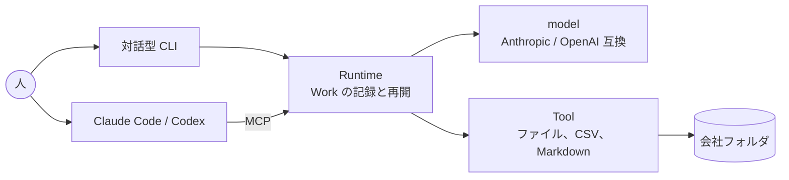

<p align="center">
  <picture>
    <source media="(prefers-color-scheme: dark)" srcset="assets/openshain_horizontal_lockup_color_for-dark.svg">
    
  </picture>
</p>

<p align="center">汎用のエージェントを、あなたの会社で働く専門社員にする対話型のエージェントハーネスです。</p>

<p align="center">
  <a href="https://github.com/openshain/openshain/actions/workflows/ci.yml"></a>
  <a href="https://www.npmjs.com/package/openshain"></a>
  <a href="LICENSE"></a>
</p>

<p align="center">
  <a href="#3-行で始める">3 行で始める</a> ·
  <a href="#できること">できること</a> ·
  <a href="#使い方">使い方</a> ·
  <a href="#claude-code-から">Claude Code から</a> ·
  <a href="#知識の投入導線">知識</a> ·
  <a href="#設計思想">設計思想</a> ·
  <a href="README.en.md">English</a>
</p>

```
$ openshain
openshain · サンプル株式会社 · 社員エージェント みなと · anthropic/claude-haiku-4-5-20251001
 ╔═╗ ╔═╗ ╔═╗ ╔╗╔ ╔═╗ ╦ ╦ ╔═╗ ╦ ╔╗╔
 ║ ║ ╠═╝ ║╣  ║║║ ╚═╗ ╠═╣ ╠═╣ ║ ║║║
 ╚═╝ ╩   ╚═╝ ╝╚╝ ╚═╝ ╩ ╩ ╩ ╩ ╩ ╝╚╝
openshain 0.1.0
/home/alice/sample-company

> 7月の領収書を category ごとに集計して、件数と合計を summary.md に書いて

  ⎿ fs_list .
  ⎿ fs_list receipt
  ⎿ csv_read receipt/2026-07.csv
  ⎿ csv_aggregate receipt/2026-07.csv
  ⎿ fs_write summary.md
  ⎿ 完了。
  ⎿ 書き込み summary.md
  ⎿ model 呼び出し 6 回、Tool 呼び出し 5 回、入力 22738 トークン(うちキャッシュ 4602)、出力 1077 トークン
  ⎿ 次に動く人はいません。

⏺ 完了しました。
  
  7月の領収書をcategoryごとに集計して、summary.mdに書きました。
  
  集計結果は以下の通りです。
  
  総件数：296件
  総合計金額：3,258,930円
  
  categoryごとの内訳：
  - 会議費：18件、23,370円
  - 広告宣伝費：31件、793,220円
  - 支払手数料：31件、1,170,950円
  - 新聞図書費：24件、104,580円
  - 旅費交通費：66件、132,980円
  - 水道光熱費：31件、585,690円
  - 消耗品費：28件、99,300円
  - 福利厚生費：18件、38,570円
  - 荷造運賃：20件、137,900円
  - 通信費：29件、172,370円
  
  summary.mdファイルに作成されています。
```

社員エージェントと対話型 CLI で会話できます。

## 3 行で始める

```
bun install -g openshain   # Bun 1.3 以上が要ります
openshain init             # 会社フォルダに設定と MCP の登録を書きます
openshain                  # 社員エージェントと話します
```

> [!IMPORTANT]
> model の API キーは環境変数(`ANTHROPIC_API_KEY` など)からだけ読みます。設定ファイルにも記録にも書きません。

Claude や Codex のようなエージェントは、会社のルールと業務手順、SaaS や Office のファイルを扱う手、権限と承認、セッションをまたいで残る仕事の状態、証跡とコストに関する仕組みと情報が足りず、そのままでは会社の社員として働けません。

openshain はエージェントハーネスとして、会社の社員として働くために必要な仕組みと情報を補います。openshain の CLI を使わずに、openshain が提供する **MCP サーバー** を使って、Claude Code や Codex の上に独自のハーネスを組むこともできます。

## できること

- **対話型 CLI**: `openshain` で社員エージェントとの会話セッションを開始します。依頼を投げると、社員エージェントが Work にして進め、結果を返します
- **Work の記録と再開**: 依頼を Work として遂行し、過程と結果が `work/<id>/events.jsonl` に残ります。途中で止めても再開できます
- **モデル**: `openshain init` が作る設定ファイルでモデルを指定します。API キーはお手持ちのものを使います(Bring Your Own Key)。Anthropic と OpenAI 互換 API に対応しています
- **標準 Tool**: 会社フォルダの中でファイルの読み書きと検索、CSV の読み取りと集計、Markdown の読み取りをします。フォルダの外には出ず、ファイルを丸ごと model に渡しません
- **Tool の追加**: 第三者の Tool を設定に 1 行足すだけで、CLI と MCP の両方から使えます
- **Claude Code などの汎用エージェントから使う**: `openshain mcp` が MCP サーバーです。Claude Code や Codex に登録すると、同じハーネスをそれらのエージェントの上で使えます

### 現在対応している職種

- 汎用(`generic`): 会社フォルダのファイルを扱う一般事務です
- (開発中) 経理: 台帳と証憑の照合、月次のまとめ、経理に固有の知識を持った職種です

職種は `openshain.yaml` の `profession` で選びます。指示文と読む場所を書けば、自分の職種を作れます。

> [!NOTE]
> 権限、承認、専門家へのエスカレーションはこれからです。

### 仕組み



考えるのは model、記録と再開は Runtime、ファイルに触るのは Tool です。どの入口から入っても同じ Runtime を通り、同じ `work/` に残ります。

## インストール

### Bun でのインストール

[Bun](https://bun.sh) 1.3 以上が要ります。

```
bun install -g openshain   # openshain コマンドが入ります
openshain --help           # 入ったことを確かめます
```

<details>
<summary>バイナリとソースからのインストール</summary>

### バイナリでのインストール

[GitHub Releases](https://github.com/openshain/openshain/releases) に Linux(x64、arm64)と macOS(x64、arm64)の単体バイナリがあります。ダウンロードして実行権限をつけ、PATH の通った場所に `openshain` という名前で置きます。

```
chmod +x openshain-linux-x64            # 実行権限をつけます
mv openshain-linux-x64 ~/.local/bin/openshain   # PATH の通った場所に置きます
```

#### macOS

> [!TIP]
> ブラウザでダウンロードしたバイナリは、初回の実行を Gatekeeper が止めます。隔離属性を外してから実行します。

```
xattr -d com.apple.quarantine openshain   # 隔離属性を外します
```

#### Windows

Windows 向けのバイナリはまだありません。Bun でのインストールか、WSL の Linux バイナリを使ってください。

### ソースからのインストール

```
git clone https://github.com/openshain/openshain.git && cd openshain
bun install                      # 依存を入れます
bun run build                    # dist/openshain に単体バイナリができます
```

</details>

## 使い方

```
mkdir my-company && cd my-company   # 会社フォルダを作ります
openshain init                      # 設定ファイルと MCP の登録、AGENTS.md を書きます
export ANTHROPIC_API_KEY=...        # 使う model の API キーです
openshain                           # 社員エージェントとの会話を始めます
```

`openshain` は画面全体を使う会話の画面です。上が会話の履歴、下が入力欄です。依頼を書くと社員エージェントが Work にして進め、経過が `⎿` の行で流れ、結果が返ります。Work が質問すればその場で答えられます。画面の操作とスラッシュコマンドは `/help` で出ます。

```
openshain                       # 対話型 CLI を起動します
openshain init                  # 会社フォルダを初期化します
openshain run "<依頼>"          # 会話を挟まずに Work を 1 つ実行します
openshain work list             # Work の一覧を出します
openshain work show <id>        # Work の記録を読みます
openshain work resume <id>      # 止まった Work を続けます
openshain tools list            # 使える Tool を出します
openshain mcp                   # MCP サーバーとして起動します(通常はエージェントが起動します)
```

Tool を足す例は [examples/](examples/README.md) にあります。

### Claude Code から

1. `openshain init` が会社フォルダに `.mcp.json` を書きます。既にあれば、他の server を残して openshain の項目だけを足します
2. 会社フォルダで `claude` を起動し、フォルダを信頼します。Claude Code が `.mcp.json` を読んで `openshain mcp` を自分で起動し、接続します。`/mcp` に openshain が出ます
3. 依頼を書きます。考えるのは Claude Code で、会社のファイルの読み書きと記録は openshain の Tool が行います。その使い分けは `AGENTS.md` が伝えます
4. 依頼の記録と成果物は会社フォルダの `work/` に残り、`openshain work list` と `openshain work show <id>` で読めます

Codex など他のエージェントでも、`openshain mcp` を stdio の MCP サーバーとして登録すれば同じです。

## 設定

`openshain.yaml` に会社、職種、model、Tool を書きます。

- 全項目は [docs/configuration.md](docs/configuration.md) にあります
- `openshain init` が書く `openshain.yaml` に、各項目の説明がコメントで入っています

## 知識の投入導線

社員エージェントが会社の人として働くには、会社ごとの決まりと、日本の法域に固有の知識の 2 種類が要ります。入れる場所と経路を分けています。

### ユーザー固有のポリシー・知識

会社の決まり(経費の規程、承認の基準、取引先ごとの扱い、書式)と、会社の書類(台帳、契約、過去の申請)です。いまの版では 3 つの経路で入ります。

- `openshain.yaml` の `profession.instructions`。職種の指示文で、すべての Work の system prompt の先頭に入ります。短い決まりはここに書きます
- 会社フォルダのファイル。規程や手順書、台帳を置くだけで、社員エージェントは標準 Tool で読みます。読んでほしい場所は指示文で示します(「経費の規程は rules/expenses.md にある」)。渡るのは頼まれた範囲のファイルだけで、フォルダの外には出ません
- `AGENTS.md`。Claude Code や Codex から使うときの指示です。会社の決まりをここに書けば、それらのエージェントも同じ決まりで動きます

これからの版では、会社の決まりと根拠の資料に出典と有効日を持たせ、索引から引ける形にしていきます。model には Work に必要な分だけを渡し(Need-to-Know)、権限のない資料は検索結果にも入りません。

### 継続的な日本法域固有知識

法令、通達、ガイドライン、様式、期限は会社ごとに書くものではなく、変わり続けます。これは職種と一緒に届ける知識として扱い、出典と有効日を持ち、版と時点で引けるようにします。最初の対象は経理です。

OSS はどの提供元の知識でも読み込めます(Bring Your Own Knowledge)。公式に保守する日本の法域の知識は、更新を追い続ける運用として届けるもので、設計思想の 4 に沿います。この知識がなくても、会社フォルダに置いた文書だけで社員エージェントは働けます。

## 設計思想

1. 社員エージェントは会社の人と同じ約束のもとで働きます。何を頼まれ、何をして、何を残したかを記録します
2. 会社の日常の事務は OSS だけで最後まで完了できます
3. openshain 自身が作る Tool や model provider も、第三者が作るものと同じインターフェース(ToolProvider、ModelProvider、MCP)を通ります。対話型 CLI だけが使える裏口はありません
4. 有償で提供するものがあるなら(マネージドサービス、日本の法域に固有の知識を継続して届けることなど)、それは openshain を利用者に代わって動かし続ける運用の対価です。機能を解禁する対価ではありません

原則の全文は [docs/principles.md](docs/principles.md)、各 package の設計と理由は [docs/design/](docs/design/README.md)、仕様は [spec/](spec/README.md) にあります。

### しないこと

- 会社フォルダの外には出ません。SaaS や会計ソフトの代わりにはならず、そこから出したファイルを扱います
- 金額の計算、権限の判断、状態の遷移を model に任せません。これらはコードが持ちます
- 利用者のデータを openshain の運営者に送りません。通信先は設定した model の API だけです

## 開発

Bun 1.3 以上が要ります。

```
git clone https://github.com/openshain/openshain.git && cd openshain
bun install                            # 依存を入れます
bun run typecheck && bun run lint && bun test   # 変更を送る前に通す 3 つです
bun packages/cli/src/bin.ts            # ソースのまま CLI を動かします
bun run build                          # dist/openshain に単体バイナリを作ります
bun run schemas                        # spec/schemas/ を zod の定義から作り直します
```

- 構成は `packages/` の 5 つです。core(インターフェース、Work の記録、投影)、agent(tool loop、model provider、セッション)、tools(標準 Tool)、mcp(MCP サーバー)、cli(`openshain` コマンドと画面)
- 本物の API を呼ぶテストは `OPENSHAIN_LIVE_TESTS=1` と API キーの環境変数があるときだけ走ります
- 第三者の Tool の例は [examples/tools/echo](examples/tools/echo) にあります。設定に 1 行足すだけで CLI と MCP の両方から呼べます
- 規約と構成は [AGENTS.md](AGENTS.md)、貢献のしかたは [CONTRIBUTING.md](CONTRIBUTING.md)、脆弱性の報告は [SECURITY.md](SECURITY.md)、変更の履歴は [CHANGELOG.md](CHANGELOG.md) にあります

## ライセンス

Apache-2.0。[LICENSE](LICENSE) と [NOTICE](NOTICE) を見てください。

<p align="center"><sub><a href="SECURITY.md">脆弱性の報告</a> · <a href="CONTRIBUTING.md">貢献のしかた</a> · <a href="CHANGELOG.md">変更の履歴</a> · <a href="assets/README.md">ロゴ</a></sub></p>
